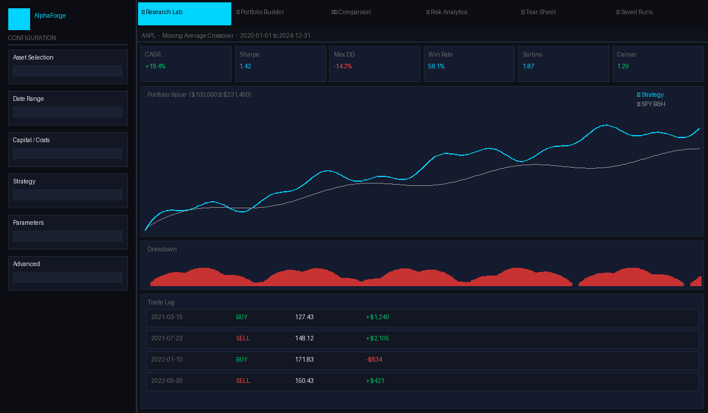
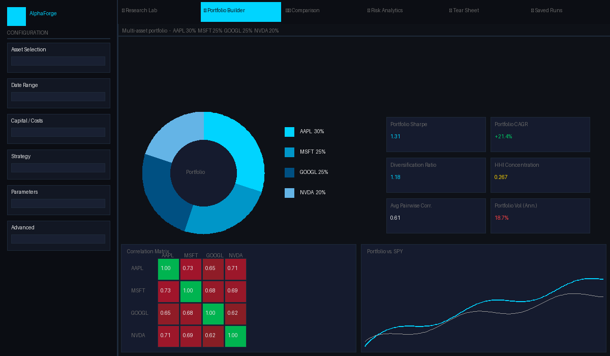
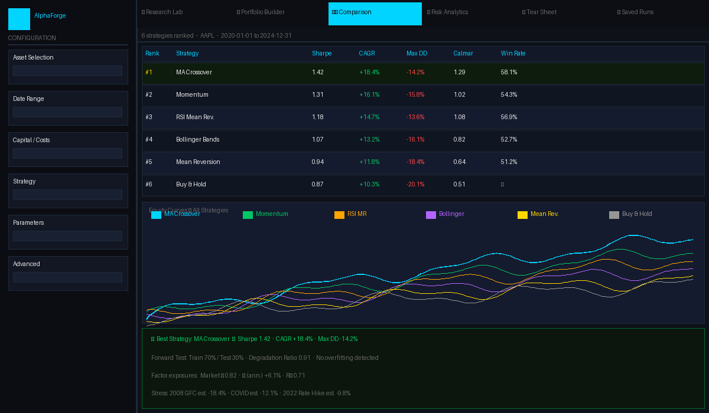
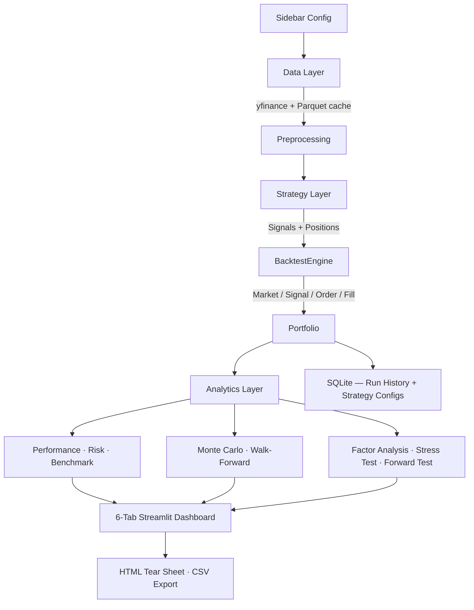

<div align="center">
  <h1>⚡ AlphaForge</h1>
  <br>

  [](https://python.org)
  [](https://streamlit.io)
  [](#running-tests)
  [](LICENSE)
  [](https://github.com/shahwfabian/AlphaForge)

  <br>

  **[⭐ Star this repo](https://github.com/shahwfabian/AlphaForge) · [🐛 Report Bug](https://github.com/shahwfabian/AlphaForge/issues) · [💡 Request Feature](https://github.com/shahwfabian/AlphaForge/issues)**

</div>

---

## Screenshots

<div align="center">

| 🔬 Research Lab | 📊 Portfolio Builder |
|:---:|:---:|
|  |  |

| ⚔️ Strategy Comparison |
|:---:|
|  |

</div>

---

## What is AlphaForge?

AlphaForge is not a stock price predictor. It is not a toy trading bot.

It is a **research infrastructure platform** — the kind of system that quantitative researchers and systematic traders actually build to evaluate trading ideas rigorously before risking capital.

Six professional-grade tabs. 400+ searchable assets. Event-driven backtesting engine. ETF-proxy factor analysis. Nine stress scenarios. Forward testing with overfitting detection. Institutional-quality HTML tear sheets. 348 passing tests.

**Built to be resume-worthy for quantitative finance, software engineering, and trading technology roles.**

---

## Features

| Category | Capability |
|---|---|
| **Data** | yfinance OHLCV · Parquet caching · 400+ asset universe (stocks, ETFs, bonds, crypto) |
| **Strategies** | MA Crossover · Mean Reversion · Momentum · RSI · Bollinger Bands · Buy & Hold |
| **Backtesting** | Event-driven (Market→Signal→Order→Fill) · Transaction costs · Slippage · No lookahead bias |
| **Performance** | CAGR · Sharpe · Sortino · Calmar · Omega · Serenity · Win Rate · Profit Factor |
| **Risk** | Historical VaR/ES · Parametric VaR · Ulcer Index · Rolling Volatility |
| **Benchmark** | Alpha · Beta · R² · Tracking Error · Information Ratio |
| **Monte Carlo** | Gaussian · Block Bootstrap · GBM · Stress Scenarios · P5/P50/P95 fan |
| **Portfolio** | Equal-weight · Custom-weight · HHI concentration · Diversification ratio |
| **Comparison** | Rank 6 strategies side-by-side · Overlaid equity curves · Drawdown comparison |
| **Factor Analysis** | ETF-proxy OLS (SPY/IWM/QQQ/VTV/AGG/GLD) · Alpha · Beta · R² |
| **Stress Testing** | 9 predefined scenarios (GFC, COVID, Dot-Com …) + custom shock calibration |
| **Forward Testing** | Train/test split · Degradation ratio · Overfitting flag |
| **Tear Sheet** | Self-contained HTML + CSV · Embedded Plotly charts · Professional formatting |
| **Storage** | SQLite strategy configs · SQLite run history · CSV export |
| **Dashboard** | 6-tab Streamlit · Plotly · Dark theme · 14 chart types |

---

## 6-Tab Interface

```
🔬 Research Lab        — Backtest any strategy on any asset. Full metrics, charts, trade log.
📊 Portfolio Builder   — Multi-asset weighted portfolio. Correlation heatmap. Diversification analytics.
⚔️  Strategy Comparison — Rank all 6 strategies side-by-side. Overlaid equity curves.
🧮 Risk Analytics      — Factor exposure (ETF proxy OLS). 9 stress scenarios. Forward testing.
📋 Tear Sheet          — Generate + download professional HTML/CSV strategy report.
💾 Saved Runs          — Save, reload, rename, and delete strategy configurations (SQLite).
```

---

## Asset Universe

AlphaForge ships with **400+ U.S.-tradeable instruments** in a curated local CSV.

| Asset Type | Count | Examples |
|---|---|---|
| **Stocks** | ~200 | AAPL, MSFT, NVDA, JPM, XOM, LLY, TSLA, AMZN … |
| **Index ETFs** | ~29 | SPY, QQQ, VTI, IWM, DIA, EFA, EEM … |
| **Sector ETFs** | ~25 | XLK, XLF, XLV, SMH, SOXX, HACK … |
| **Bond ETFs** | ~29 | TLT, AGG, BND, HYG, LQD, TIPS … |
| **Commodity ETFs** | ~16 | GLD, SLV, USO, GDX, PDBC … |
| **Thematic ETFs** | ~18 | ARKK, BOTZ, ICLN, SCHD, MTUM … |
| **Leveraged ETFs** | ~13 | TQQQ, SQQQ, UPRO, SOXL, VXX … |
| **Crypto ETFs** | 5 | IBIT, FBTC, GBTC, ETHE, BITO |

Search by ticker prefix, name fragment, or asset type filter. All 400+ results available instantly — no API key, no rate limits.

---

## Tech Stack

| Layer | Technology |
|---|---|
| Dashboard | Streamlit 1.35+ |
| Data | yfinance · Pandas · NumPy |
| Visualisation | Plotly |
| Analytics | SciPy · statsmodels |
| Storage | SQLite · Parquet |
| Images | Pillow |
| Testing | pytest · pytest-cov (348 tests) |
| Deployment | Docker · Railway |

---

## Architecture



---

## Installation

### 1. Clone

```bash
git clone https://github.com/shahwfabian/AlphaForge.git
cd AlphaForge
```

### 2. Virtual environment

```bash
python -m venv .venv

# Windows
.venv\Scripts\activate

# macOS / Linux
source .venv/bin/activate
```

### 3. Install dependencies

```bash
pip install -r requirements.txt
```

### 4. Run

```bash
streamlit run app.py
```

Open **http://localhost:8501**

---

## Running Tests

```bash
# All 348 tests
pytest tests/ -v

# With coverage report
pytest tests/ --cov=src --cov-report=term-missing
```

---

## Project Structure

```
AlphaForge/
│
├── app.py                              # Streamlit entry point — 6-tab layout
├── requirements.txt
├── Dockerfile / docker-compose.yml
├── railway.toml
│
├── assets/
│   ├── logo.png          (optional)    # Drop your logo here — auto-used everywhere
│   ├── logo_mark.png     (optional)    # Compact emblem for sidebar/favicon
│   └── screenshots/                    # README screenshots
│
├── src/
│   ├── data/
│   │   ├── data_loader.py              # yfinance + Parquet cache
│   │   ├── preprocessing.py            # Clean, returns, rolling vol
│   │   ├── validation.py               # Input validation
│   │   ├── asset_universe.py           # 400+ asset search/autocomplete
│   │   └── assets.py                   # Legacy asset list
│   │
│   ├── strategies/
│   │   ├── base_strategy.py
│   │   ├── moving_average.py
│   │   ├── mean_reversion.py
│   │   ├── momentum.py
│   │   ├── rsi.py
│   │   ├── bollinger.py
│   │   └── buy_hold.py
│   │
│   ├── backtester/
│   │   ├── engine.py                   # Event loop
│   │   ├── portfolio.py                # Cash + holdings
│   │   ├── trade_log.py
│   │   └── events.py                   # Market/Signal/Order/Fill
│   │
│   ├── analytics/
│   │   ├── performance.py              # Return + ratio metrics
│   │   ├── risk.py                     # VaR, ES, rolling risk
│   │   ├── benchmark.py                # Alpha, beta, tracking error
│   │   ├── monte_carlo.py
│   │   ├── optimizer.py                # Grid search
│   │   ├── walk_forward.py             # IS vs OOS validation
│   │   ├── comparison.py               # Multi-strategy ranking
│   │   ├── factor_analysis.py          # ETF-proxy OLS regression
│   │   ├── stress_testing.py           # 9 scenarios + custom shock
│   │   ├── diversification.py          # Correlation, DR, HHI
│   │   └── forward_testing.py          # Train/test split, degradation ratio
│   │
│   ├── portfolio/
│   │   └── allocation.py               # Equal/custom weight, normalize, HHI
│   │
│   ├── reports/
│   │   └── tear_sheet.py               # HTML + CSV tear sheet generator
│   │
│   ├── storage/
│   │   ├── database.py                 # Run history SQLite
│   │   ├── strategy_configs.py         # Strategy config save/load
│   │   └── exporter.py                 # CSV helpers
│   │
│   └── dashboard/
│       ├── components.py               # All Streamlit UI sections
│       └── charts.py                   # 19 Plotly figure builders
│
├── tests/                              # 348 pytest tests
│   ├── test_asset_universe.py          # 66 tests
│   ├── test_portfolio.py               # 31 tests
│   ├── test_stress_testing.py          # 19 tests
│   ├── test_diversification.py         # 27 tests
│   ├── test_strategy_configs.py        # 22 tests
│   ├── test_comparison.py              # 16 tests
│   └── ...
│
├── data/
│   ├── asset_universe.csv              # 400+ instrument definitions
│   ├── raw/                            # Parquet cache (gitignored)
│   └── processed/                      # Processed Parquet (gitignored)
│
└── docs/
    └── resume_bullets.md               # Interview-ready resume bullets
```

---

## Deployment

### Railway (recommended — one click)

The `railway.toml` is pre-configured. Push to GitHub → connect Railway → deploy.

```toml
[build]
dockerfile = "Dockerfile"

[deploy]
startCommand = "streamlit run app.py --server.port=${PORT:-8501} --server.address=0.0.0.0"
```

### Streamlit Community Cloud

1. Push to GitHub
2. Go to [share.streamlit.io](https://share.streamlit.io) → New app
3. Set main file: `app.py`
4. Deploy — no secrets or API keys required

### Docker

```bash
docker compose up --build
# Open http://localhost:8501
```

---

## Backtesting Methodology

- **Lookahead bias prevention** — signals shifted 1 bar; `min_periods=window` suppresses warm-up noise
- **Realistic costs** — configurable transaction cost (bps) + slippage per fill
- **Benchmark** — SPY Buy & Hold at zero cost as the passive baseline
- **Overfitting awareness** — every optimisation is paired with walk-forward validation and a forward-test degradation ratio

---

## Risk Metrics Explained

| Metric | Definition |
|---|---|
| **Sharpe Ratio** | `(E[r] - rf) / σ(r) × √252` |
| **Sortino Ratio** | Sharpe using downside deviation only |
| **Calmar Ratio** | CAGR / |Max Drawdown| |
| **Omega Ratio** | Probability-weighted gains / losses above threshold |
| **VaR 95%** | Worst daily loss not exceeded 95% of the time |
| **Expected Shortfall** | Average loss in the worst 5% of days (Basel III) |
| **Diversification Ratio** | Weighted-avg individual vol / portfolio vol — DR > 1 = benefit |
| **HHI** | Herfindahl concentration score — 1/N (equal) to 1.0 (single asset) |
| **Degradation Ratio** | OOS Sharpe / IS Sharpe — below 0.5 flags overfitting |

---

## Limitations

- Survivorship bias — yfinance excludes delisted securities
- Gaussian Monte Carlo assumes i.i.d. returns — ignores fat tails and vol clustering
- Fixed-rate slippage — real market impact is nonlinear and size-dependent
- No multi-leg strategies, no execution latency, no bid-ask spread modelling
- **For research and education only — not live trading advice**

---

## Future Roadmap

- [ ] Options pricing (Black-Scholes + Monte Carlo Greeks)
- [ ] Pairs trading (Engle-Granger / Johansen cointegration)
- [ ] Portfolio optimisation (Markowitz + Black-Litterman)
- [ ] FinBERT sentiment signal integration
- [ ] Real-time WebSocket data feed
- [ ] PostgreSQL migration for multi-user cloud deployment
- [ ] User authentication + saved strategy library

---

## Resume Bullets

See [`docs/resume_bullets.md`](docs/resume_bullets.md) for interview-ready bullets, GitHub description copy, and a LinkedIn post.

---

## License

[MIT License](LICENSE) — free to use, modify, and distribute.

---

<div align="center">
  <sub>⚡ Built with Python · Pandas · NumPy · Streamlit · Plotly · SQLite · SciPy</sub>
</div>
